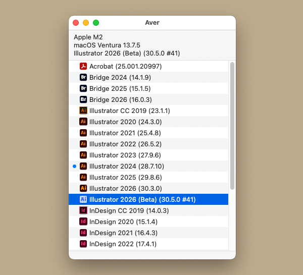

# Aver

macOS用デスクトップアプリ

インストールされているAdobeアプリを詳細なバージョン付きで一覧表示。

## 用途

お使いのMacにインストールされているAdobeアプリを、詳細なバージョン情報とともに一覧表示します。バージョン確認の手間を省き、効率的なAdobe製品の管理をサポートします。

## Tips

- ウインドウ上部の情報表示は選択してコピーできます
- メニュー「表示 > 更新」でリストを更新します
- メニュー「表示 > フィルタ」で特定のアプリのみリスト表示します

## 動作環境

macOS 13.0 Ventura 以降（Universal Binary）

## ライセンス

Copyright © 2023-2026 monokano
